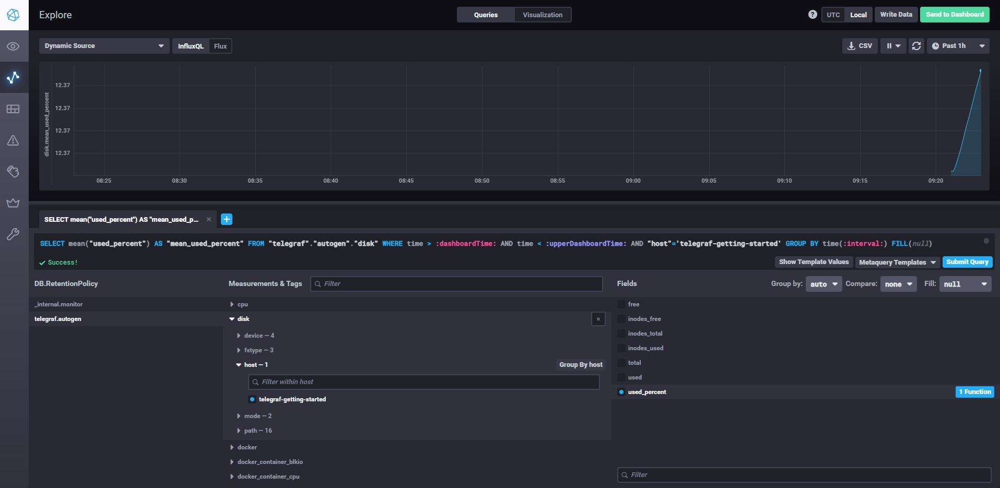

# Домашнее задание к занятию "10.02. Системы мониторинга"

## Обязательные задания

1. Опишите основные плюсы и минусы pull и push систем мониторинга.  

Ответ:  
- pull-модель требует открытия дополнительных портов для подключения сервера к агенту, например http, тогда как в push-модели соединение устанавливает агент
- в pull-модели сервер сам устанавливает соединение, а значит можно быть уверенным в подлинности получаемых метрик
- в push-модели существует вероятность неправильной настройки агента и данные могут уходить не туда (маловероятно, но все же), но с другой стороны, возможность слать данные на несколько серверов является плюсом
- в pull-модели легче обеспечить шифрованное соединение, пустив трафик через reverse proxy, в pusр-модели сертификат понадобится каждому агенту
- в push-модели агент может отсылать метрики сразу же после события, тогда как в pull-модели существует какой-то период опроса, а значит события произошедшие в период между опросами не учитываются (хотя наверняка эта проблема как-то решена)
- push-модель может быть более производительна из-за того, что основана на udp

2. Какие из ниже перечисленных систем относятся к push модели, а какие к pull? А может есть гибридные?

    - Prometheus - *pull*
    - TICK - *push*
    - Zabbix - *push и pull*
    - VictoriaMetrics - *push и pull*
    - Nagios - *pull*

3. Склонируйте себе [репозиторий](https://github.com/influxdata/sandbox/tree/master) и запустите TICK-стэк, 
используя технологии docker и docker-compose.

В виде решения на это упражнение приведите выводы команд с вашего компьютера (виртуальной машины):

    - curl http://localhost:8086/ping  
    
       $ curl http://localhost:8086/ping
       $ curl -I http://localhost:8086/ping
            HTTP/1.1 204 No Content
            Content-Type: application/json
            Request-Id: 3acd8bca-36c9-11ec-8258-0242ac120003
            X-Influxdb-Build: OSS
            X-Influxdb-Version: 1.8.10
            X-Request-Id: 3acd8bca-36c9-11ec-8258-0242ac120003
            Date: Wed, 27 Oct 2021 01:57:24 GMT
       Почему оно ничего не отдает? так и должно быть?  
       
    - curl http://localhost:8888  
    
    $ curl http://localhost:8888
     <!DOCTYPE html><html><head><meta http-equiv="Content-type" content="text/html; charset=utf-8"><title>Chronograf</title><link rel="icon shortcut"    href="/favicon.fa749080.ico"><link rel="stylesheet" href="/src.3dbae016.css"></head><body> <div id="react-root" data-basepath=""></div> <script src="/src.fab22342.js"></script> </body></html>
    
    - curl http://localhost:9092/kapacitor/v1/ping  
    
    curl -I http://localhost:9092/kapacitor/v1/ping
        HTTP/1.1 204 No Content
        Content-Type: application/json; charset=utf-8
        Request-Id: 8e5829b0-36c9-11ec-828f-000000000000
        X-Kapacitor-Version: 1.6.2
        Date: Wed, 27 Oct 2021 01:59:44 GMT
     И тут ничего не отдает, но подключается же

А также скриншот веб-интерфейса ПО chronograf (`http://localhost:8888`). 

P.S.: если при запуске некоторые контейнеры будут падать с ошибкой - проставьте им режим `Z`, например
`./data:/var/lib:Z`

4. Перейдите в веб-интерфейс Chronograf (`http://localhost:8888`) и откройте вкладку `Data explorer`.

    - Нажмите на кнопку `Add a query`
    - Изучите вывод интерфейса и выберите БД `telegraf.autogen`
    - В `measurments` выберите mem->host->telegraf_container_id , а в `fields` выберите used_percent. 
    Внизу появится график утилизации оперативной памяти в контейнере telegraf.
    - Вверху вы можете увидеть запрос, аналогичный SQL-синтаксису. 
    Поэкспериментируйте с запросом, попробуйте изменить группировку и интервал наблюдений.

Для выполнения задания приведите скриншот с отображением метрик утилизации места на диске 
(disk->host->telegraf_container_id) из веб-интерфейса.


5. Изучите список [telegraf inputs](https://github.com/influxdata/telegraf/tree/master/plugins/inputs). 
Добавьте в конфигурацию telegraf следующий плагин - [docker](https://github.com/influxdata/telegraf/tree/master/plugins/inputs/docker):
```
[[inputs.docker]]
  endpoint = "unix:///var/run/docker.sock"
```

Дополнительно вам может потребоваться донастройка контейнера telegraf в `docker-compose.yml` дополнительного volume и 
режима privileged:
```
  telegraf:
    image: telegraf:1.4.0
    privileged: true
    volumes:
      - ./etc/telegraf.conf:/etc/telegraf/telegraf.conf:Z
      - /var/run/docker.sock:/var/run/docker.sock:Z
    links:
      - influxdb
    ports:
      - "8092:8092/udp"
      - "8094:8094"
      - "8125:8125/udp"
```

После настройке перезапустите telegraf, обновите веб интерфейс и приведите скриншотом список `measurments` в 
веб-интерфейсе базы telegraf.autogen . Там должны появиться метрики, связанные с docker.
  
Факультативно можете изучить какие метрики собирает telegraf после выполнения данного задания.

---
